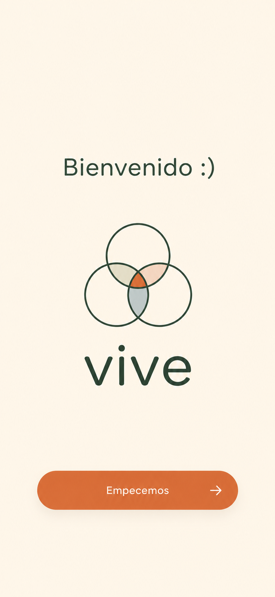
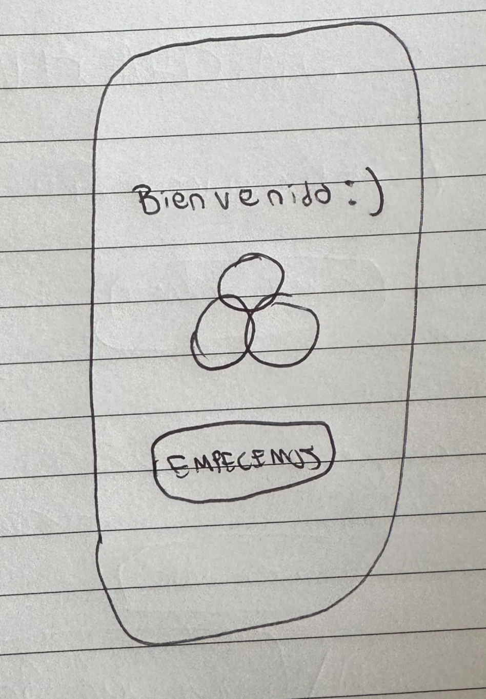

# Onboarding

El usuario responde:

- Quiero claridad sobre algo
- Quiero hablar con alguien
- Solo estoy explorando
- Estoy en un momento de cambio

Y la aplicación lo lleva directamente al camino más lógico.

Ejemplos:

- “Quiero hablar con alguien” → Conexiones.
- “Solo estoy explorando” → Inicio.
- “Quiero claridad” → Explorar.

---

**Pantalla 1 — La bienvenida.**

Esta es la única pantalla donde el usuario no hace nada todavía. Solo recibe. Es la primera impresión de VIVE — tiene que transmitir la energía de la marca en 2 segundos.

Según tus documentos, esa energía es: exploración, claridad, calidez, humanidad. No "arreglarte", no productividad, no clínico.

## Bifurcación usuario / coach — Pantalla 2A

Antes de la pregunta emocional, la pantalla 2 bifurca entre dos roles. *(Copy exacto a definir con el equipo de marca.)*

- **Quiero crecer** → flujo de usuario, continúa a Pantalla 2B (pregunta emocional)
- **Quiero acompañar** → flujo de coach, abre formulario de aplicación dentro de la app

**Flujo del coach desde acá:**

1. Completa el formulario de aplicación (datos personales, especialidad, video de aplicación, etc.)
2. La app muestra: *"Estamos revisando tu perfil. Te avisaremos cualquier novedad."*
3. VIVE revisa y coordina entrevista por mail
4. Si es aceptado → cuenta se activa y completa su perfil público
5. Si es rechazado → notificación con motivo, puede volver a aplicar

**Nota:** cuenta de coach y cuenta de usuario son separadas. Si un coach quiere usar VIVE como usuario, necesita una cuenta distinta.

---

**Pantalla 2B — La pregunta emocional** *(solo para el flujo de usuario)*

Esta es la pantalla más importante del onboarding. Es donde el usuario siente por primera vez que VIVE lo está escuchando, no procesando.

La pregunta tiene que ser emocional, no funcional. No "¿qué feature querés usar?" sino "¿qué está pasando en tu vida ahora?"

La pregunta no está solamente recolectando información. Está decidiendo qué experiencia inicial vive cada usuario.

Evita uno de los mayores riesgos de VIVE: Mostrar todo de golpe.

## Onboarding definitivo MVP

**Filosofía:** dos pantallas, tres opciones. El onboarding tiene un solo trabajo — llevar al usuario al lugar correcto lo más rápido posible. Los tooltips contextuales hacen el resto cuando el usuario entra a cada sección por primera vez.

---

### Pantalla 1 — Bienvenida

- Fondo crema, "vive" en terracota centrado, Poppins Bold
- Subtítulo en verde profundo: "Tu camino empieza acá"
- Botón: "¿Empezamos?"

---

### Pantalla 2 — ¿Cómo querés empezar?

Tres opciones que cubren todos los perfiles reales:

- **"Quiero explorar la app"** → entra directo a Inicio
- **"Sé qué necesito, busco con quién"** → entra a Conexiones con buscador activo
- **"No sé por dónde empezar"** → arranca el matching guiado directo

Una sola respuesta posible. Botón "¿Seguimos?" aparece cuando el usuario elige.

*Los tres perfiles reales del usuario de VIVE:*

- *El que no sabe de qué se trata — solo quiere explorar*
- *El que sabe qué necesita pero no sabe con quién — quiere buscar directamente*
- *El que quiere mejorar pero no sabe qué necesita — necesita orientación*

---

### Tooltips contextuales

La primera vez que el usuario entra a cada sección (Inicio, Recursos, Conexiones), aparece un cartelito breve que explica qué es. Solo la primera vez, nunca más.

---

### Stack técnico del MVP

- **Framework:** React Native + Expo SDK 56
- **Repositorio:** [github.com/AndreAlbisu/vive-app](http://github.com/AndreAlbisu/vive-app)
- **Tipografía:** Poppins (Regular, Medium, SemiBold, Bold)
- **Paleta:** terracota #E8743B · crema #FBF6EF · verde profundo #1F4A43 · verde brote #6BBF8A · azul sereno #5B8DB8
- **Herramienta de desarrollo:** Claude Code
- **Testing:** Expo Go
- **Quiero claridad sobre algo**

Esta persona tiene una inquietud.

No necesariamente quiere ayuda humana.

Quiere entender algo.

Entonces tiene sentido llevarla primero a Explorar.

- Quiero hablar con alguien

Esta persona ya llegó con una necesidad mucho más definida.

Sería un error obligarla a recorrer contenido.

Lo que quiere es encontrar a alguien.

Por eso este onboarding debería ser el más corto.

- **Solo estoy explorando:**

Esta persona no quiere que la empujen.

Quiere curiosear.

Si le hacés diez preguntas: abandona.

Si le mostrás coaches inmediatamente: se siente presionada.

Su onboarding debería ser el más liviano.

- Quiero crecer pero no sé por dónde / Estoy en un momento de cambio

Acá aparece la oportunidad más interesante.

Porque probablemente sea el usuario ideal de VIVE.

No está perdido.

No está solamente curioseando.

Está atravesando algo.

Y ahí es donde VIVE puede desplegar toda su propuesta de valor.

Las cuatro respuestas representan cuatro estados mentales completamente distintos.

Una sola respuesta posible. Sin "siguiente" visible hasta que elige, el botón aparece cuando toca una opción.

## CAMINO 1: “Solo estoy explorando”

###

Opcion 1: Perfecto. No hace falta saber exactamente qué estás buscando. A veces explorar también es una forma de encontrarlo.

Después entra directamente a la aplicación.

Y las explicaciones aparecen únicamente cuando visita cada sección por primera vez.

Por ejemplo:

- entra a Inicio → pequeña explicación.
- entra a Explorar → pequeña explicación.
- entra a Conexiones → pequeña explicación.

La filosofía detrás de esta opción es:

“Primero viví la experiencia. Después te explico.”

Opcion 2: La diferencia es que la pantalla intermedia es más emocional y menos contextual.

Opcion 3: Después de elegir “Solo estoy explorando”, aparece una pantalla que explica:

- qué es Inicio,
- qué es Explorar,
- qué es Conexiones.

Y recién después entra a la aplicación.

La filosofía es:

“Primero entendé el mapa. Después empezá a usarlo.”

Elegiria la 2 : Después, medir si la gente entiende Inicio, Explorar y Conexiones y si necesitamos agregar  explicaciones contextuales.

## CAMINO 2: QUIERO HABLAR CON ALGUIEN

Este es el camino más directo hacia Conexiones.

La persona ya sabe que está buscando acompañamiento humano, por lo que el objetivo no es mostrarle contenido ni hacerlo recorrer la aplicación, sino ayudarlo a encontrar profesionales relevantes de la forma más simple posible.

### Pantalla 3

Perfecto.

En VIVE vas a encontrar personas que dedican su trabajo a acompañar el crecimiento de otros.

Podés explorar profesionales por tu cuenta o dejar que te ayudemos a encontrar a alguien que encaje con lo que estás buscando.

---

🔍 Explorar profesionales

Navegá perfiles, talleres y especialidades a tu ritmo.

---

✨ Ayudarme a encontrar a alguien

Respondé algunas preguntas y te mostraremos profesionales que podrían encajar con vos.

### Si elige "Explorar profesionales"

El usuario entra directamente a Conexiones.

Puede:

- navegar perfiles,
- explorar especialidades,
- descubrir talleres,
- guardar favoritos,
- utilizar filtros.

El objetivo es darle libertad para encontrar por sí mismo a la persona adecuada.

### Si elige "Ayudarme a encontrar a alguien"

Te lleva a conexiones y comienza un breve proceso de matching.

**CAMINO 3: QUIERO CLARIDAD SOBRE ALGO**

**CAMINO 4: Estoy en un momento de cambio" / "Quiero crecer pero no sé por dónde"**

Camino:

🌱 “Quiero crecer pero no sé por dónde”

↓

Mini experiencia interactiva:

### **Un día cualquiera**

Te levantás cansado.

Dormiste mal.

↓

Llegás al trabajo estresado.

↓

Discutís con tu pareja.

↓

No encontrás tiempo para vos.

---

Y VIVE le muestra:

El desarrollo personal no es una sola cosa.

Es aprender a cuidar distintas áreas de tu vida.

🌱 Cuerpo

🧠 Mente

✨ Alma

---

Y recién después le recomienda recursos.

---

Me gusta porque contextualiza.

No es:

“Tomá este curso.”

Es:

“Esto es lo que podrías mejorar.”